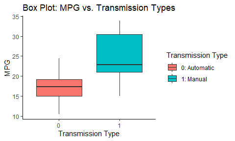

```r
# load libraries
suppressMessages(library(dplyr))
suppressMessages(library(ggplot2))

# load data
data(mtcars)
```

# Regression Models Week 4 Project 1


## # Executive Summary

-----

In this project, we'll explore two main requests:

1. Is an automatic or manual transmission better for MPG?
2. Quantify the MPG difference between automatic and manual transmissions.

For the purposes of this project, we'll be using the 'mtcars' data set. Results can be found at the bottom of this document.

## # EDA

-----

Let's start with some light exploratory data analysis.


```r
# inspect data - hidden to prevent page overage
# head(mtcars)
# str(mtcars)

# plot
ggplot(mtcars, aes(x = as.factor(am), y = mpg)) + 
  geom_boxplot(aes(fill = as.factor(am))) + 
  ggtitle('Box Plot: MPG vs. Transmission Types') + 
  xlab('Transmission Type') +
  ylab('MPG') + 
  labs(fill = 'Transmission Type') + 
  scale_fill_discrete(name = 'Transmission Type', labels = c('0: Automatic', '1: Manual')) + 
  theme_classic()
```

<!-- -->

At first glance, it appears that manual transmission types (type == 1) have a higher median MPG compared to automatic transmission types (type == 0). Before we get into our models, let's transform our dataset a bit to make it easier to comprehend. First, we'll encode character values for the transmission type.


```r
# cleaned df
df <- mtcars %>%
  mutate(trans = ifelse(am == 0, 'Automatic', 'Manual'))
```

Next, we'll make our first model: a simple linear model. We'll regress MPG and transmission type.

```r
# linear model
model1 <- lm(mpg ~ trans, data = df)

# view the summary of the model
summary(model1)
```

```
## 
## Call:
## lm(formula = mpg ~ trans, data = df)
## 
## Residuals:
##     Min      1Q  Median      3Q     Max 
## -9.3923 -3.0923 -0.2974  3.2439  9.5077 
## 
## Coefficients:
##             Estimate Std. Error t value Pr(>|t|)    
## (Intercept)   17.147      1.125  15.247 1.13e-15 ***
## transManual    7.245      1.764   4.106 0.000285 ***
## ---
## Signif. codes:  0 '***' 0.001 '**' 0.01 '*' 0.05 '.' 0.1 ' ' 1
## 
## Residual standard error: 4.902 on 30 degrees of freedom
## Multiple R-squared:  0.3598,	Adjusted R-squared:  0.3385 
## F-statistic: 16.86 on 1 and 30 DF,  p-value: 0.000285
```


```r
# plot residuals - hidden from output to prevent the report from being too long
plot(model1)
```

From the summary statistics of the model, we can see that, for automatic transmissions, the mean MPG is 17.147. However, adding in the fact that a vehicle is a manual, increases the MPG by 7.245. This means, per our linear model, that manual transmissions are better for MPG than automatic. Also, we can quantify this difference, assuming no other vehicle factors, as a 7.245 MPG increase for manuals over automatics.

To support our analysis, we'll fit a second model: a multiple linear model. This will allow us to see if other factors are necessary to determine if manuals truly have higher MPG than automatics. For this model, I'll layer gradually layer in the following variables: cyl, disp, and wt. We'll use ANOVA to see if these factors are worth including in predicting MPG.


```r
# multiple linear models
model2 <- lm(mpg ~ trans + cyl, data = df)
model3 <- lm(mpg ~ trans + cyl + disp, data = df) 
model4 <- lm(mpg ~ trans + cyl + disp + wt, data = df)

# compare models
anova(model1, model2, model3, model4)
```

```
## Analysis of Variance Table
## 
## Model 1: mpg ~ trans
## Model 2: mpg ~ trans + cyl
## Model 3: mpg ~ trans + cyl + disp
## Model 4: mpg ~ trans + cyl + disp + wt
##   Res.Df    RSS Df Sum of Sq       F    Pr(>F)    
## 1     30 720.90                                   
## 2     29 271.36  1    449.53 64.4149 1.264e-08 ***
## 3     28 252.08  1     19.28  2.7628  0.108046    
## 4     27 188.43  1     63.66  9.1213  0.005468 ** 
## ---
## Signif. codes:  0 '***' 0.001 '**' 0.01 '*' 0.05 '.' 0.1 ' ' 1
```

Based on our ANOVA, we can see that the third model actually doesn't provide us with statistical significance. However, the fourth model, with all of our chosen factors does. For this second model analysis. We'll use the fourth model as it has the lowest SSE out of the models fitted.


```r
# summary statistics
summary(model4)
```

```
## 
## Call:
## lm(formula = mpg ~ trans + cyl + disp + wt, data = df)
## 
## Residuals:
##    Min     1Q Median     3Q    Max 
## -4.318 -1.362 -0.479  1.354  6.059 
## 
## Coefficients:
##              Estimate Std. Error t value Pr(>|t|)    
## (Intercept) 40.898313   3.601540  11.356 8.68e-12 ***
## transManual  0.129066   1.321512   0.098  0.92292    
## cyl         -1.784173   0.618192  -2.886  0.00758 ** 
## disp         0.007404   0.012081   0.613  0.54509    
## wt          -3.583425   1.186504  -3.020  0.00547 ** 
## ---
## Signif. codes:  0 '***' 0.001 '**' 0.01 '*' 0.05 '.' 0.1 ' ' 1
## 
## Residual standard error: 2.642 on 27 degrees of freedom
## Multiple R-squared:  0.8327,	Adjusted R-squared:  0.8079 
## F-statistic: 33.59 on 4 and 27 DF,  p-value: 4.038e-10
```

From the above results, we can see that the MPG impact of the transmission type, with the additional variables is neither statistically significant nor is it as large as our simple linear regression. We'll remove the 'disp' variable to create a fifth model.


```r
# summary statistics
model5 <- lm(mpg ~ trans + cyl+ wt, data = df)

# summary stats
summary(model5)
```

```
## 
## Call:
## lm(formula = mpg ~ trans + cyl + wt, data = df)
## 
## Residuals:
##     Min      1Q  Median      3Q     Max 
## -4.1735 -1.5340 -0.5386  1.5864  6.0812 
## 
## Coefficients:
##             Estimate Std. Error t value Pr(>|t|)    
## (Intercept)  39.4179     2.6415  14.923 7.42e-15 ***
## transManual   0.1765     1.3045   0.135  0.89334    
## cyl          -1.5102     0.4223  -3.576  0.00129 ** 
## wt           -3.1251     0.9109  -3.431  0.00189 ** 
## ---
## Signif. codes:  0 '***' 0.001 '**' 0.01 '*' 0.05 '.' 0.1 ' ' 1
## 
## Residual standard error: 2.612 on 28 degrees of freedom
## Multiple R-squared:  0.8303,	Adjusted R-squared:  0.8122 
## F-statistic: 45.68 on 3 and 28 DF,  p-value: 6.51e-11
```

```r
# plot residuals
par(mfrow = c(2, 2))
plot(model5)
```

<!-- -->

In this model, holding all else equal, an automatic vehicle has an average MPG of 39.42 whereas a manual vehicle has an average MPG of 39.42 + 0.18 = 39.60 MPG. This means, even still, a manual vehicle offers, on average, greater MPG benefits compared to an automatic vehicle. In our multiple linear regression model, this difference can be quantified as a 0.18 MPG increase favoring manual transmission types. What's important to note is that our multiple linear regression model shows that transManual isn't statistically significant in determining MPG. This suggests that other variables have a greater impact on MPG when taking a holistic approach.

## # Results and Conclusions

-----

As stated above, we fit two models: a simple linear regression model and a multiple linear regression model. Our results, by model, are summarized below.

1. Simple Linear Regression: Manual transmission types offer better MPG by an increase of 7.245 MPG.
2. Multiple Linear Regression: Manual transmission types offer better MPG by an increase of 0.18 MPG.

However, it's important to note that transmission type alone does not guarantee a higher/lower MPG. It's important to look at other vehicle factors, as we did in our multiple linear regression model, and external factors such as driving style, road conditions, and weather conditions.
