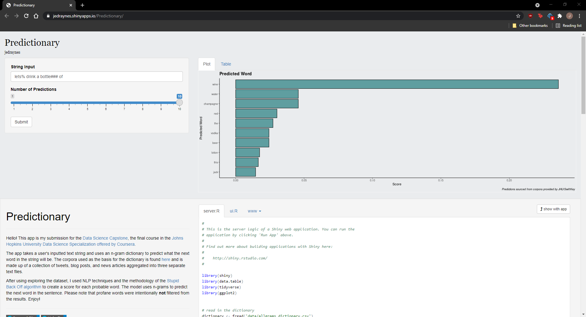

## Project Overview

The Data Science Capstone project involves analyzing a corpora of text, as sourced from Twitter, Blogs, and News text files provided by the course teachers in partnership with SwiftKey. After exploratory data analysis, a model was constructed, and subsequently this presentation and a web-based application, to showcase the model.

The goal of the model: predict the next word in a string of text using NLP techniques.

## Approach

For this project, my approach involved using the Stupid Back Off methodology as documented by the original researchers [here](https://www.aclweb.org/anthology/D07-1090.pdf). The model takes a user input, cleans it to get a processed string input, and predicts the next word based on a dictionary of scored n-grams from a corpora provided by the course professors in partnership with SwiftKey.

**Key terms**:

- *N-gram*: a string of text of length n (e.g., bigram would be a two word string, trigram a three word string, and so on)

## Example Output

{width=100%}

## Conclusion

**Problem Areas**

While the model sometimes predicts the right word, given the myriad of options, it's difficult to gain a high-level of accuracy. To further develop the program I'd like to explore using higher-level n-grams (such as 4 or 5-grams) or explore other existing algorithms.

**Thank You!**

You can find me on [LinkedIn](https://www.linkedin.com/in/jedraynes/), [GitHub](https://github.com/jedraynes), or check out my [personal website](https://jedraynes.com/).

