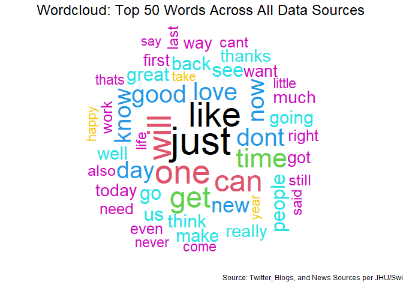
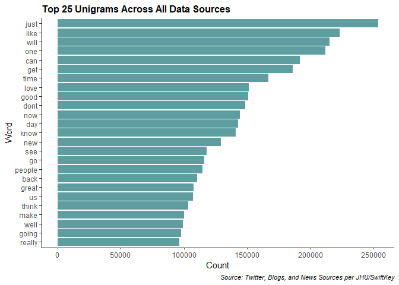
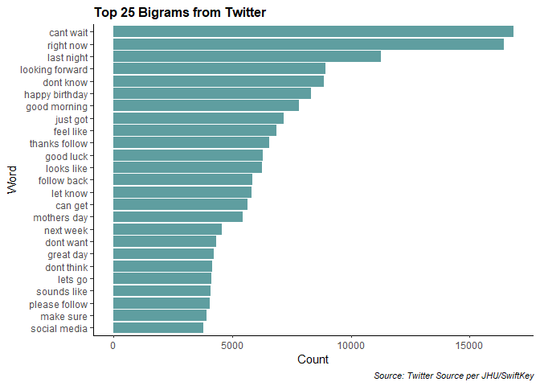
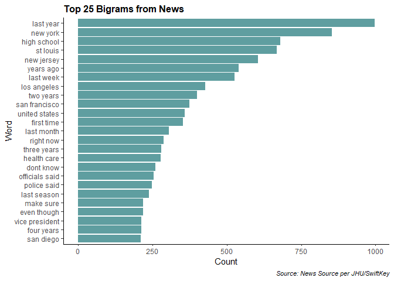
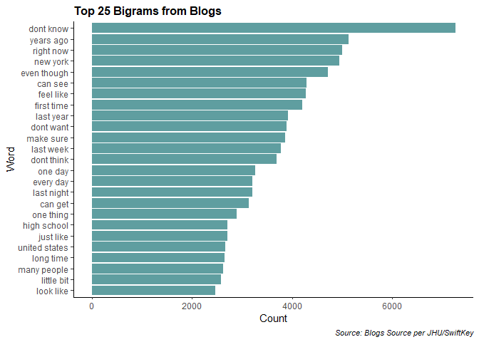

# Data Science Capstone: Milestone Report

### # Project Overview

---

In this project, I was provided three .txt files from Twitter, Blogs, and News sources to build a word prediction model. This is a concept commonly seen in text environments, such as a cell phone's predicitons while texting. The idea is to build a similar, albeit simple, version of that model by using Natural Lanaguage Processing (NLP) to analyze past text to predict future text. The data for this project is sourced from Johns Hopkins University in partnership with SwiftKey.

### # Approach

---

Before starting my analysis, I wanted to get a sense of the project requirements. Knowing I'll have to analyize n-grams of the data, I knew I had to learn NLP techniques to get from unstructured text data to clean n-grams that can be used for analysis. I decided that's where I wanted to begin this project. After exploring the data, I intend to determine an appropriate method for (i) subsetting the data to a manageable size, (ii) using NLP techniques to build a model that predicts using the historical n-grams I analyze, and (iii) handle unseen n-gram combinations.

### # Exploratory Data Analysis

---

Now, I'll get into the exploratory data analysis (EDA) of our source files. To keep this report brief, I've hidding / set echo = FALSE for a lot of the R code. This allows the results to be presented cleanly. Code will eventually be posted on my GitHub so others can reproduce my analysis.

After loading packages and reading in the data, I started by getting a sense of the size of the data, prior to any data processing. The code output below prints the size of each source.


```r
# setup
knitr::opts_knit$set(root.dir = 'C:\\Users\\Jed\\iCloudDrive\\Documents\\Learn\\R\\Johns Hopkins Data Science Specialization\\10 Data Science Capstone\\Capstone Project\\final\\en_US')
```


```r
# load in the data
twitter <- readLines('en_US.twitter.txt')
news <- readLines('en_US.news.txt')
blogs <- readLines('en_US.blogs.txt')
```


```r
# line counts
paste('There are ', length(twitter), ' lines in the Twitter dataset.', sep = '')
```

```
## [1] "There are 2360148 lines in the Twitter dataset."
```

```r
paste('There are ', length(news), ' lines in the News dataset.', sep = '')
```

```
## [1] "There are 77259 lines in the News dataset."
```

```r
paste('There are ', length(blogs), ' lines in the Blogs dataset.', sep = '')
```

```
## [1] "There are 899288 lines in the Blogs dataset."
```


```r
# convert the data to a dataframe
twitter <- data.frame(txt = twitter, stringsAsFactors = FALSE)
news <- data.frame(txt = news, stringsAsFactors = FALSE)
blogs <- data.frame(txt = blogs, stringsAsFactors = FALSE)
```

I then cleaned the dataset by defining stopwords, removing punctuation, removing non-ascii characters, removing digits, and removing the defined stopwords. The result is a clean, multi-line list that matches the lines of the original dataset but is cleaned using the steps mentioned above.


```r
# define stop words
stopwords <- stopwords('english')
stopwords <- c(stopwords, 'im', 'ill', 'u', 'lol', 's', 't', 'rt', 'NA')

# filter out punctuation, non-ascii characters, and numbers
# unnesting the dataframe, grouping by the original line number to maintain integrity
# removing stopwords as defined
# regrouping the data by the original line and only selecting the text to get a cleaned dataframe that can be re-tokenized

twitter <- twitter %>%
  mutate(txt = tolower(txt)) %>%
  mutate(txt = str_remove_all(txt, '[[:punct:]]')) %>%
  mutate(txt = str_remove_all(txt, '[^[:ascii:]]')) %>%
  mutate(txt = str_remove_all(txt, '[[:digit:]]')) %>%
  mutate(line = row_number()) %>%
  unnest_tokens(output = word, input = txt) %>%
  filter(!word %in% stopwords) %>%
  group_by(line) %>%
  summarize(txt = str_c(word, collapse = ' ')) %>%
  select(txt)

news <- news %>%
  mutate(txt = tolower(txt)) %>%
  mutate(txt = str_remove_all(txt, '[[:punct:]]')) %>%
  mutate(txt = str_remove_all(txt, '[^[:ascii:]]')) %>%
  mutate(txt = str_remove_all(txt, '[[:digit:]]')) %>%
  mutate(line = row_number()) %>%
  unnest_tokens(output = word, input = txt) %>%
  filter(!word %in% stopwords) %>%
  group_by(line) %>%
  summarize(txt = str_c(word, collapse = ' ')) %>%
  select(txt)

blogs <- blogs %>%
  mutate(txt = tolower(txt)) %>%
  mutate(txt = str_remove_all(txt, '[[:punct:]]')) %>%
  mutate(txt = str_remove_all(txt, '[^[:ascii:]]')) %>%
  mutate(txt = str_remove_all(txt, '[[:digit:]]')) %>%
  mutate(line = row_number()) %>%
  unnest_tokens(output = word, input = txt) %>%
  filter(!word %in% stopwords) %>%
  group_by(line) %>%
  summarize(txt = str_c(word, collapse = ' ')) %>%
  select(txt)
```

After processing the data, I created a master list of the text into one dataset.


Then, using the wordcloud library, I created a wordcloud with the top 50 words by frequency across all data sources. This can be seen in the image below.

<!-- -->

I then wanted to see how many words it would take to achieve cumulative 50% and 90% coverage. This was done by calculating the running frequency and subsetting the data to where the resulting dataset would be <= 50% or <= 90%. The amount of words in these coverages can be found in the output below.


```
## [1] "Number of words with 50% coverage: 817. Number of words with 90% coverage: 15869."
```

I then too a look at unigram, or one-word n-grams. This is essentially the same concept as the wordcloud, but it helps us see, in a bar plot, the frequency counts. The top 25 words across all texts can be seen in the graph below.

<!-- -->

Simialrly, I did the same for bigrams, or two-word n-grams. Given the size of the data, I did this on a per-source basis (i.e., top bigrams for the Twitter, News, and Blogs datasets, respectively).

<!-- -->


<!-- -->


<!-- -->
