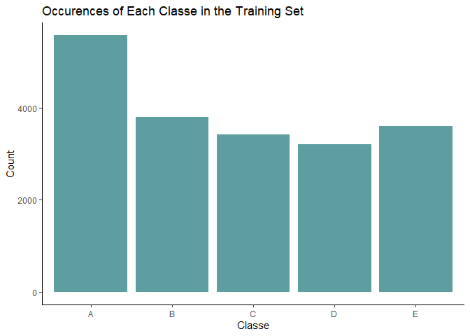
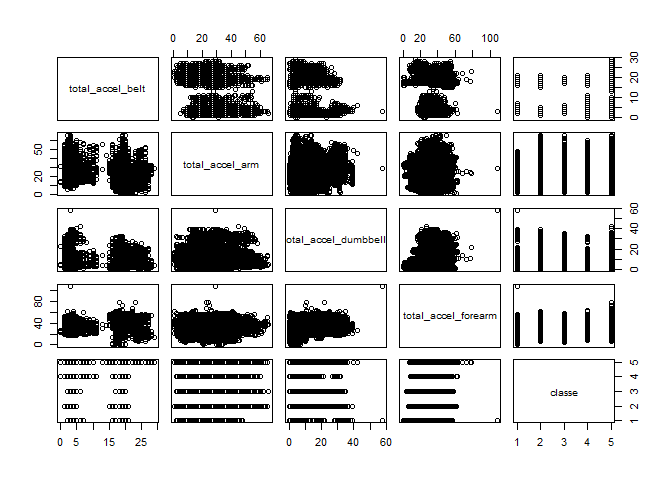

# Practical Machine Learning Week 4 Project 1

### # Summary

---

In this project, I'll inspect the data from the Weight Lifting Exercises dataset. An archive page of the data can be found [here](http://web.archive.org/web/20161224072740/http:/groupware.les.inf.puc-rio.br/har).

### # Exploratory Data Analysis

---

We'll start by exploring the dataset. We'll only load in the training data for now to prevent exploration into our test set.


```r
# load data
training <- read.csv('https://d396qusza40orc.cloudfront.net/predmachlearn/pml-training.csv', stringsAsFactors = FALSE)[, -1]

training_copy <- training
# explore the data - hidden to save report space
#View(training)

# explore the prediction variable
unique(training$classe)
```

```
## [1] "A" "B" "C" "D" "E"
```

```r
ggplot(training, aes(x = classe)) + 
  geom_bar(fill = 'cadetblue') + 
  xlab('Classe') + 
  ylab('Count') + 
  labs(title = 'Occurences of Each Classe in the Training Set') + 
  theme_classic()
```

<!-- -->

```r
# drop the first six columns
training <- training[, -c(1:6)] # drop these same columns in the test set

# preprocessing for null columns
col_sums <- colSums(is.na(training))
col_sums_df <- data.frame(col_sums)
null_columns <- rownames(filter(col_sums_df, col_sums != 0)) # remember to drop these same columns in the test set
training_clean <- training[, !names(training) %in% null_columns]

# preprocessing to non-numeric columns
numerics <- unlist(lapply(training_clean, is.numeric)) # remember to drop these same columns in the test set
training_clean <- training_clean[, numerics]

# inspect the total columns
training_clean_totals <- training_clean %>% select(contains('total'))
training_clean_totals$classe <- as.factor(training$classe)

# add in the classe column
training_clean$classe <- as.factor(training$classe)

# pairs
pairs(training_clean_totals)
```

<!-- -->


### # Analysis

---

We are predicting a factor, categorical data point. Thus, it makes the most sense to go with a classification model. We'll try a decision tree and a random forest.


```r
# split the training set into training and validation
in_train <- createDataPartition(y = training_clean$classe, p = 0.80, list = FALSE)
train_set <- training_clean[in_train, ]
validation_set <- training_clean[-in_train, ]

# decision tree -----
model_dt <- train(classe ~ ., method = 'rpart', data = train_set)
preds_dt <- predict(model_dt, newdata = validation_set)
confusionMatrix(table(preds_dt, validation_set$classe))$overall['Accuracy']
```

```
##  Accuracy 
## 0.4861076
```

```r
# random forest -----
model_rf <- train(classe ~ ., method = 'rf', data = train_set)
preds_rf <- predict(model_rf, newdata = validation_set)
confusionMatrix(table(preds_rf, validation_set$classe))$overall['Accuracy']
```

```
##  Accuracy 
## 0.9941371
```

There's a clear accuracy gain with the random forest over the decision tree. For my final model, I'll go with my random forest model and predict on the test samples.


```r
# load the test set in
testing <- read.csv('https://d396qusza40orc.cloudfront.net/predmachlearn/pml-testing.csv', stringsAsFactors = FALSE)[, -1]
dim(testing)
```

```
## [1]  20 159
```

```r
testing_copy <- testing

# preprocess: remove the first six columns
#View(testing)
testing <- testing[, -c(1:6)]

# preprocess: remove the null columns
testing_clean <- testing[, !names(testing) %in% null_columns]

# preprocess: remove the non-numeric columns
testing_clean <- testing_clean[, numerics]

# predict on the testing set
test_preds <- predict(model_rf, newdata = testing_clean)

# final preds
final_result <- data.frame(index = 1:20, classe = test_preds)
final_result
```

```
##    index classe
## 1      1      B
## 2      2      A
## 3      3      B
## 4      4      A
## 5      5      A
## 6      6      E
## 7      7      D
## 8      8      B
## 9      9      A
## 10    10      A
## 11    11      B
## 12    12      C
## 13    13      B
## 14    14      A
## 15    15      E
## 16    16      E
## 17    17      A
## 18    18      B
## 19    19      B
## 20    20      B
```

```r
names(testing_clean)
```

```
##  [1] "roll_belt"            "pitch_belt"           "yaw_belt"            
##  [4] "total_accel_belt"     "gyros_belt_x"         "gyros_belt_y"        
##  [7] "gyros_belt_z"         "accel_belt_x"         "accel_belt_y"        
## [10] "accel_belt_z"         "magnet_belt_x"        "magnet_belt_y"       
## [13] "magnet_belt_z"        "roll_arm"             "pitch_arm"           
## [16] "yaw_arm"              "total_accel_arm"      "gyros_arm_x"         
## [19] "gyros_arm_y"          "gyros_arm_z"          "accel_arm_x"         
## [22] "accel_arm_y"          "accel_arm_z"          "magnet_arm_x"        
## [25] "magnet_arm_y"         "magnet_arm_z"         "roll_dumbbell"       
## [28] "pitch_dumbbell"       "yaw_dumbbell"         "total_accel_dumbbell"
## [31] "gyros_dumbbell_x"     "gyros_dumbbell_y"     "gyros_dumbbell_z"    
## [34] "accel_dumbbell_x"     "accel_dumbbell_y"     "accel_dumbbell_z"    
## [37] "magnet_dumbbell_x"    "magnet_dumbbell_y"    "magnet_dumbbell_z"   
## [40] "roll_forearm"         "pitch_forearm"        "yaw_forearm"         
## [43] "total_accel_forearm"  "gyros_forearm_x"      "gyros_forearm_y"     
## [46] "gyros_forearm_z"      "accel_forearm_x"      "accel_forearm_y"     
## [49] "accel_forearm_z"      "magnet_forearm_x"     "magnet_forearm_y"    
## [52] "magnet_forearm_z"
```

### # Final Thoughts

---

I just ran the final predictions through the auto-grading quiz and it resulted in a 100%...wow. To recap my model, I used the caret package to run a random forest model. I pre-processed the data in three key steps: 1) removed the demographic and time data that is represented in the first six columns, 2) removed the columns where it was all NA/NULL, and 3) removed the non-numeric columns. I tried a decision tree model that scored rather poorly on my validation set. I then went with a random forest model, which took a while to run, that scored extremely well...99% accuracy at the time I ran it on 3/23/21. The model was chosen as this case is a multi-classification problem so I wasn't able to use regression based models nor binary classification models. Given there are distinctive actions and positions when completing an exercise, I figured a tree based model would perform best. Finally, after processing the datasets, I was left with the key sensor information used in the study: belt, arm, dumbbell, and forearm. These positional areas, along with the data points from each position help isolate what exercise is being performed. In the future, I'd like to explore different models, especially a boosted multi-classification model to see how it performs in comparison.


